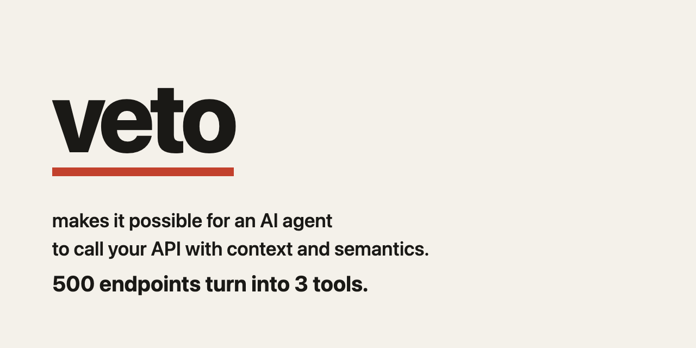

Imagine Harbor sells home goods. Orders, customers, and billing are the three APIs that run that business. This demo hosts them under `app/`. Veto sits in front of them. Your APIs stay where they already run.

```bash
make demo
```

`make help` lists the other targets. That needs Go 1.27.1. Veto is the module `github.com/aiveto/veto` in `go.mod`.

## What veto does

You point veto at your OpenAPI. The model gets three tools: search, describe, and invoke (`capabilities_search`, `capabilities_describe`, `capabilities_invoke`). It does not get one tool for every operation. The model can ask for a call. Veto decides whether it runs. A delete waits until a person says yes. The model never receives the OpenAPI file.

## The story

`make demo` runs that on Harbor twice: once over the CLI, once over MCP.

Harbor has twenty-five operations. "Retire order" and "scrap order" both find the delete. Retire is already known. Scrap is an extra word in `app/semantics.yaml`, beside the sentence that this call waits for a person.

Order 10482 is Mara Ellison's wool coat and two cedar trays, $556. Reading it also reads Mara, and her paid invoice, because those links are written in `app/relations.yaml`. Search returns those related ids and `related_calls`. The invoke result names the same calls in `next_calls`, with the ids from the order. The warehouse id on the order is not a link, so nothing calls it.

Jonas Adler asks to cancel his linen throw, order 10490. That call reaches Harbor. Deleting Mara's order does not. Veto stops and asks a person. The pending id is not approval; sending it back is `pending_approval` and does not call Harbor. Approving it gives a new id. That id deletes the order once, and then the order is gone.

## Your turn

Harbor is on `127.0.0.1:18410` (orders), `:18411` (customers), and `:18412` (billing). Calls want `Authorization: Bearer demo-token`.

| You want | Open | Run |
| --- | --- | --- |
| Claude, Cursor, or ChatGPT | `app/prompts/claude.md` | `make mcp` |
| A skill, or the CLI | `app/prompts/skill.md` | `make cli` |
| A link from one API to another | `app/relations.yaml` | |
| The words for a call | `app/semantics.yaml` | |
| The file that names the APIs | `app/veto.yaml` | |
| Harbor's OpenAPI | `app/contracts/` | |
| The process hosting the business | `app/desks/` | `make mcp` |

`make mcp` leaves the business listening and prints the config to paste into Claude, Cursor, or ChatGPT. Paste `app/prompts/claude.md` as the instruction.

That prompt asks the agent to retire Mara's order. It reads the order, follows the customer and the invoice, and stops with an id that is only a request. Sending that pending id back is `pending_approval`. `veto approve --config app/veto.yaml` that id prints a second id. Hand the agent the second id. The delete runs once. A cancel does not wait. Ask it to cancel order 10490 if you want that from the agent.

`make cli` plays the same story through `veto search`, `veto describe`, and `veto invoke`. `veto --help-json` is the contract. A skill follows `app/prompts/skill.md`. `make demo` runs the CLI walk, then the MCP walk, each against a fresh Harbor.

## On your APIs

Leave them where they are. Add a `veto.yaml` that names your OpenAPI, the way `app/veto.yaml` names Harbor's. Add `relations.yaml` when reading one API should call another. Add `semantics.yaml` for an extra word, the way `scrap` names the delete. Run `veto serve` for Claude, Cursor, or ChatGPT, or `veto search`, `describe`, and `invoke` for a skill. Depend on `github.com/aiveto/veto` the same way this `go.mod` does.
